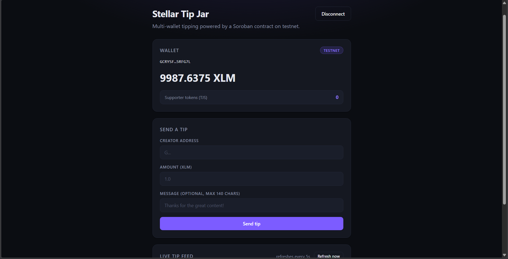
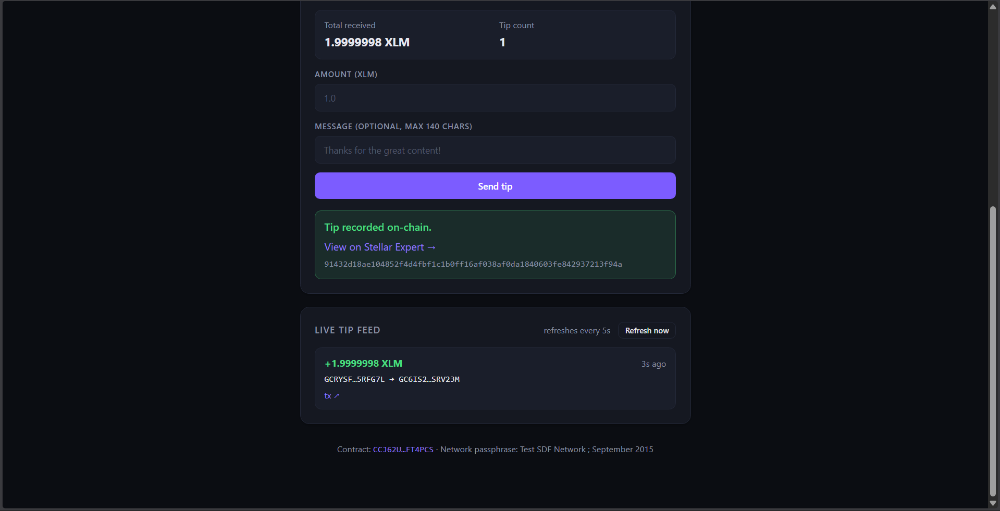
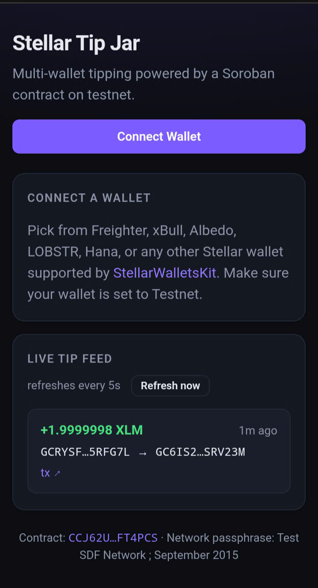

# Stellar Tip Jar

A donation page for Stellar creators. Visitors pick from any wallet supported by **StellarWalletsKit** (Freighter, xBull, Albedo, LOBSTR, Hana, …), see their testnet XLM balance, and send a tip recorded by a Soroban smart contract. Every tip emits an on-chain event that streams into a live feed. All transactions run on the Stellar **testnet**.

This repo tracks all four belts in the Stellar Journey to Mastery challenge:

- **White Belt (Level 1)** — first wallet integration + a direct XLM payment.
- **Yellow Belt (Level 2)** — multi-wallet picker, deployed Soroban `TipJar` contract, contract calls from the frontend, and a real-time event feed.
- **Orange Belt (Level 3)** — basic caching layer, skeleton loading states, frontend test suite, demo video, complete documentation, live deploy.
- **Green Belt (Level 4)** — second contract (`SupporterToken`, SEP-41), inter-contract `mint()` call from `TipJar` rewards every tipper with supporter tokens, GitHub Actions CI/CD pipeline, polished mobile-responsive layout.

> **Live demo:** https://tipjarforcreator.netlify.app/  
> **Demo video (1 min):** https://drive.google.com/file/d/17V6l_CM6R3L3HbZofJGcZQxx0sjlL2xQ/view?usp=drive_link  
> **CI status:** 

## Live deployment

### Active (L4) — TipJar v2 with inter-contract supporter-token rewards

|  |  |
| --- | --- |
| **Network** | Stellar Testnet |
| **TipJar v2 (active)** | [`CCJ62UKISYB5I5UIPIRHVO7YZ4BZVB7F2UY4NZDC6ILNEHRWIMFT4PCS`](https://stellar.expert/explorer/testnet/contract/CCJ62UKISYB5I5UIPIRHVO7YZ4BZVB7F2UY4NZDC6ILNEHRWIMFT4PCS) |
| **SupporterToken (SEP-41)** | [`CBNWKE6TH6MGAKIGJFWOT6ZXGXA5PK6GOYGVVP3W7VVK2PPCV5TZY7F4`](https://stellar.expert/explorer/testnet/contract/CBNWKE6TH6MGAKIGJFWOT6ZXGXA5PK6GOYGVVP3W7VVK2PPCV5TZY7F4) — admin = TipJar v2 |
| **Native XLM SAC** | `CDLZFC3SYJYDZT7K67VZ75HPJVIEUVNIXF47ZG2FB2RMQQVU2HHGCYSC` |
| **TipJar v2 Wasm hash** | `0f4dbd5f3c2d929c98101f55d49cd1b5ae5ec12212b914d2f0f006a6d8eec088` |
| **TipJar v2 Wasm upload tx** | [`3bad17a5218a3bb71b41e63cbfbd823f86542a35d7449c9f6a77ac3137f62a24`](https://stellar.expert/explorer/testnet/tx/3bad17a5218a3bb71b41e63cbfbd823f86542a35d7449c9f6a77ac3137f62a24) |
| **TipJar v2 Deploy tx** | [`07977423e67e73260d644ffe63f8c92cf25dde5c0cd4eca255a0d4b869d60521`](https://stellar.expert/explorer/testnet/tx/07977423e67e73260d644ffe63f8c92cf25dde5c0cd4eca255a0d4b869d60521) |
| **SupporterToken Wasm hash** | `01ea48f48fb9aed7d879082448c5445719605b9c411fffaac5255aeda6a78138` |
| **SupporterToken Wasm upload tx** | [`072f17a716a36e00594a10e5ca37537da1e9e9fb976edb0c7fb99a28bd7c9150`](https://stellar.expert/explorer/testnet/tx/072f17a716a36e00594a10e5ca37537da1e9e9fb976edb0c7fb99a28bd7c9150) |
| **SupporterToken Deploy tx** | [`650c0c6569a166955a0581ac0c090147ba7f735754f2bf16904904f1def9800f`](https://stellar.expert/explorer/testnet/tx/650c0c6569a166955a0581ac0c090147ba7f735754f2bf16904904f1def9800f) |
| **Admin transfer tx** | [`1bbdac745a784811dabc74f353ec0a0dd0021f26f3fcf12a00bef8edafd9aecf`](https://stellar.expert/explorer/testnet/tx/1bbdac745a784811dabc74f353ec0a0dd0021f26f3fcf12a00bef8edafd9aecf) — `set_admin(SupporterToken → TipJar v2)` |
| **Soroban RPC** | `https://soroban-testnet.stellar.org` |

### L2 reference contract (kept for historical verification)

|  |  |
| --- | --- |
| **TipJar v1** | [`CBAZVLIITFNYXSIBCWGKDZ2JESTWIB4ZWAWXLKVP2TY2DTSUL5DMQMWL`](https://stellar.expert/explorer/testnet/contract/CBAZVLIITFNYXSIBCWGKDZ2JESTWIB4ZWAWXLKVP2TY2DTSUL5DMQMWL) |
| **L2 contract-call tx** | [`29d50d31f2bb4830b0620292e08ae9b90c908e0cc3d7af6c275560e06712f9d2`](https://stellar.expert/explorer/testnet/tx/29d50d31f2bb4830b0620292e08ae9b90c908e0cc3d7af6c275560e06712f9d2) |

## Features

### Level 1
- Connect / disconnect a wallet, with auto-reconnect on reload.
- Live XLM balance from Horizon, with a Friendbot link when the account is unfunded.
- Send an XLM payment with optional 28-byte memo.
- Per-transaction status: idle → success (hash + Stellar Expert link) or failure.

### Level 2 (additions)
- **StellarWalletsKit** wallet picker — Freighter, xBull, Albedo, LOBSTR, Hana, Klever, OneKey, Bitget, Rabet, all in one modal.
- **`TipJar` Soroban contract** records every tip on-chain (sender, creator, amount, message, timestamp), exposes view functions (`total_received`, `tip_count_for`, `recent_tips`, `global_count`), and transfers native XLM via the Stellar Asset Contract.
- **Contract-driven payment flow** — frontend builds an `invokeHostFunction` op, simulates via Soroban RPC, signs with the kit, submits, and polls `getTransaction` until the ledger confirms.
- **Multi-stage status indicator** — preparing → signing → submitting → confirming → success/error.
- **Real-time tip feed** polls Soroban RPC `getEvents` every 5 seconds and renders the latest 20 tips with explorer links.
- **Per-creator stats card** — shows total XLM received and tip count for whichever creator address is currently in the recipient field, read live from the contract.
- **Five distinct error categories** surfaced to the user: `validation` (bad address, non-positive amount, oversized message), `simulation` (contract panics, insufficient balance, missing trustline), `rejected` (user closes/declines wallet prompt), `submission` (RPC reports `ERROR` status), `rpc` (network failures, confirmation timeout).

### Level 3 (additions)
- **TTL-based read cache** in `frontend/src/contract.ts` — creator stats cached for 10 s, event feed for 4 s, global counter for 15 s. Cache is invalidated automatically after a successful tip so post-write reads are always fresh. Cuts duplicate RPC calls during keystroke-driven recipient validation and overlapping refresh ticks.
- **Skeleton loading states** — shimmering placeholders for the live feed (initial load) and creator stats panel keep the UI from flashing dashes while RPC calls are in flight.
- **Frontend test suite** — Vitest with 17 tests covering value conversion (`xlmToStroops`, `stroopsToXlm`), the `decodeSimError` translation table, and `ContractError` semantics. Pure helpers were extracted into `frontend/src/lib.ts` so tests don't pull in the wallet kit's CJS interop quirks. Runs in &lt;1 s.
- **Vercel deploy config** at `frontend/vercel.json` — single-click deploy with SPA rewrites already wired up.

### Level 4 (additions)
- **`SupporterToken` (SEP-41) contract** under `contracts/supporter-token/` — minimal SEP-41 implementation with `mint`, `transfer`, `approve`, `allowance`, `transfer_from`, `burn`, `burn_from`, `set_admin`, plus `total_supply`. Admin-only mint, persistent balances, temporary allowances. **6 unit tests.**
- **Inter-contract call** — `TipJar.tip()` invokes `SupporterToken.mint(sender, amount)` via `env.invoke_contract` after the XLM transfer. Tippers earn 1 supporter token per XLM tipped (1:1, both 7-decimal). On testnet the admin role was transferred from the deployer to TipJar v2 so the contract can mint autonomously — see the admin-transfer tx in the deployment table.
- **Supporter token balance in the wallet card** — frontend reads `balance(your_addr)` from the SupporterToken contract on connect and after every tip, displaying the live count alongside XLM balance.
- **GitHub Actions CI** at `.github/workflows/ci.yml` — two jobs running on every push & PR: `cargo test --workspace --locked` (contracts) and `npm ci && npm test && npm run build` (frontend). Cargo + npm caches keep cold runs under a minute.
- **Mobile-responsive layout** — additional `@media (max-width: 640px)` and `@media (max-width: 380px)` breakpoints stack the header, collapse the creator-stats grid, widen buttons, lift input font-size to 16 px to suppress iOS auto-zoom, and let the feed expand without an inner scroll on small screens.
- **Total test count: 29 passing** (12 contract + 17 frontend).

## Tech stack

- **Frontend** — React 19 + TypeScript + Vite, [`@creit.tech/stellar-wallets-kit`](https://github.com/Creit-Tech/Stellar-Wallets-Kit) v2, [`@stellar/stellar-sdk`](https://github.com/stellar/js-stellar-sdk) v15 (Soroban RPC + Horizon).
- **Smart contracts** — Rust + Soroban SDK 25 (`#![no_std]`, `#[contract]`, `#[contractimpl]`, `token::Client` for the SAC, `TokenInterface` for SEP-41 conformance, `env.invoke_contract` for inter-contract calls).
- **CI** — GitHub Actions: cargo test on the workspace + Vitest + Vite production build, on every push and PR.
- **Tests** — `cargo test --workspace` (12 contract tests) + `npm test` (17 frontend tests via Vitest). **29 total.**

## How the contract call works

```
User clicks "Send tip"
  │
  ├── Frontend builds:  TipJar.tip(sender, creator, amount, message)
  ├── Soroban RPC `simulateTransaction` returns auth + footprint
  ├── `assembleTransaction` produces the prepared XDR
  ├── StellarWalletsKit.signTransaction() prompts the user's wallet
  ├── Soroban RPC `sendTransaction` submits the signed XDR
  └── Poll `getTransaction(hash)` until status === SUCCESS
       │
       └── TipJar.tip internals (single ledger transaction):
            • sender.require_auth()
            • token::Client::new(env, native_sac).transfer(sender → creator)   ← XLM moves
            • update TotalFor(creator), CountFor(creator), TipsFor(creator) (capped at 50)
            • env.invoke_contract(supporter_token, "mint", [sender, amount])   ← inter-contract call
            │     └── SupporterToken.mint(sender, amount)
            │           • admin.require_auth() (admin == TipJar contract)
            │           • write balance, bump total_supply
            │           • emit ("mint", admin, sender) → amount
            • env.events().publish(("tip", creator), (sender, amount, message, ts))
```

## Getting started locally

Prerequisites: Node 20+, npm 10+, Rust (`rustup` with the `wasm32v1-none` target installed automatically by `stellar contract build`), the [Stellar CLI](https://developers.stellar.org/docs/tools/developer-tools/cli/install-cli) (`stellar`), and a wallet extension (Freighter / xBull / etc.) set to **Testnet**.

### Frontend

```bash
cd frontend
npm install

# Optional: pre-fill the creator field & override the contract ID for forks
cp .env.example .env
# edit .env: VITE_CREATOR_ADDRESS=G..., VITE_CONTRACT_ID=C...

npm run dev      # http://localhost:5173
npm run build    # production bundle in frontend/dist
```

If you don't override `VITE_CONTRACT_ID`, the app uses the deployed testnet contract listed above.

### Testing

```bash
# Frontend (from frontend/)
npm test            # one-off run — 17 Vitest tests
npm run test:watch  # watch mode

# Contracts (from repo root)
cargo test --workspace            # 12 unit tests (6 tip-jar + 6 supporter-token)
cargo test -p tip-jar             # tip-jar only
cargo test -p supporter-token     # supporter-token only
```

GitHub Actions runs both suites + a production build on every push & PR — see `.github/workflows/ci.yml` and the CI badge at the top.

### Deploying the frontend

#### Vercel (one-click)

1. Push this repo to GitHub.
2. On Vercel, import the repo and set **Root Directory** to `frontend/`.
3. Vercel auto-detects Vite from `frontend/vercel.json`. Build command and output directory are pre-set; no extra environment variables required (the contract ID is hard-coded in `config.ts`, override only if you've redeployed your own contract).
4. Click **Deploy**. The live URL belongs in the README's _Live demo_ line at the top.

#### Netlify

Identical idea — set the base directory to `frontend`, build command `npm run build`, publish directory `dist`.

### Contracts (only needed if you redeploy)

```bash
# From the repo root
cargo test --workspace                 # 12 tests
stellar contract build                 # outputs target/wasm32v1-none/release/*.wasm

# One-time identity + fund
stellar keys generate deployer --network testnet --fund

# 1. Deploy the SupporterToken with the deployer as initial admin
stellar contract deploy \
  --wasm target/wasm32v1-none/release/supporter_token.wasm \
  --source deployer --network testnet --alias supporter-token \
  -- \
  --admin <deployer-G-address> \
  --decimal 7 \
  --name "Tip Jar Supporter" \
  --symbol "TJS"
# → captures SUPPORTER_TOKEN_ID (C…)

# 2. Deploy the TipJar v2 with both addresses as constructor args
stellar contract deploy \
  --wasm target/wasm32v1-none/release/tip_jar.wasm \
  --source deployer --network testnet --alias tip-jar-v2 \
  -- \
  --native_token CDLZFC3SYJYDZT7K67VZ75HPJVIEUVNIXF47ZG2FB2RMQQVU2HHGCYSC \
  --supporter_token <SUPPORTER_TOKEN_ID>
# → captures TIPJAR_ID (C…)

# 3. Hand the supporter-token's admin role to TipJar v2 so the
#    inter-contract `mint` call from `tip()` is authorised.
stellar contract invoke \
  --id <SUPPORTER_TOKEN_ID> \
  --source deployer --network testnet --send=yes \
  -- \
  set_admin --new_admin <TIPJAR_ID>
```

Paste the new IDs into `frontend/.env` as `VITE_CONTRACT_ID=<TIPJAR_ID>` and `VITE_SUPPORTER_TOKEN_ID=<SUPPORTER_TOKEN_ID>`.

## Project layout

```text
.
├── .github/
│   └── workflows/ci.yml    # cargo test + Vitest + Vite build (L4)
├── contracts/
│   ├── hello-world/        # initial scaffold from L1, unused
│   ├── tip-jar/            # L2/L4 Soroban contract (inter-contract mint at L4)
│   │   ├── src/lib.rs      # tip(), view fns, env.invoke_contract → mint
│   │   ├── src/test.rs     # 6 unit tests (incl. inter-contract verify)
│   │   └── Cargo.toml
│   └── supporter-token/    # L4 SEP-41 token contract
│       ├── src/lib.rs      # mint, transfer, approve, allowance, burn, set_admin
│       ├── src/test.rs     # 6 unit tests
│       └── Cargo.toml
├── frontend/
│   ├── src/
│   │   ├── App.tsx         # UI: connect, balance, tip form, live feed, supporter balance
│   │   ├── App.css / index.css
│   │   ├── config.ts       # CONTRACT_ID, SUPPORTER_TOKEN_ID, RPC_URL, …
│   │   ├── wallet.ts       # StellarWalletsKit init + helpers
│   │   ├── contract.ts     # tx pipeline, getEvents, TTL cache, supporter-balance read
│   │   ├── lib.ts          # pure helpers (xlmToStroops, ContractError, …)
│   │   ├── lib.test.ts     # Vitest — 17 tests
│   │   └── main.tsx
│   ├── docs/               # README screenshots
│   ├── vercel.json         # Vercel deploy config
│   ├── .env.example
│   └── package.json
├── Cargo.toml              # Rust workspace root
└── README.md
```

## Error handling (≥ 3 categories)

| Category | Examples | Where it's raised |
| --- | --- | --- |
| `validation` | empty / malformed address, non-positive amount, message > 140 bytes | client-side checks before signing (`App.tsx`, `contract.ts → xlmToStroops`) |
| `rejected` | user closes the wallet picker, declines the signature prompt | `pickWallet`, `signXdr` (`wallet.ts`) |
| `simulation` | contract panic (`amount must be positive`), insufficient balance, missing trustline | `decodeSimError` in `contract.ts` |
| `submission` | RPC returns `ERROR`, on-chain status not `SUCCESS` | `sendTip` (`contract.ts`) |
| `rpc` | Soroban RPC unreachable, confirmation timeout (>30 s) | `sendTip` (`contract.ts`) |

## Screenshots

### Live deploy



### Inter-contract call

Two contract events on a single transaction — `TipJar.tip` + `SupporterToken.mint`:



### Mobile responsive



## Roadmap

All four belts (White → Green) are implemented. Future polish ideas:

- Index supporter-token holders into a leaderboard.
- Replace the bundled JS warning by code-splitting the wallet kit.
- Add per-creator donation pages (`/c/G…`) so creators can share a link.
